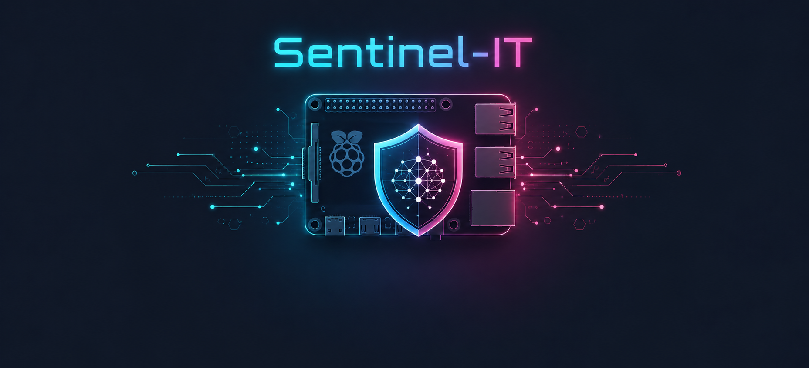
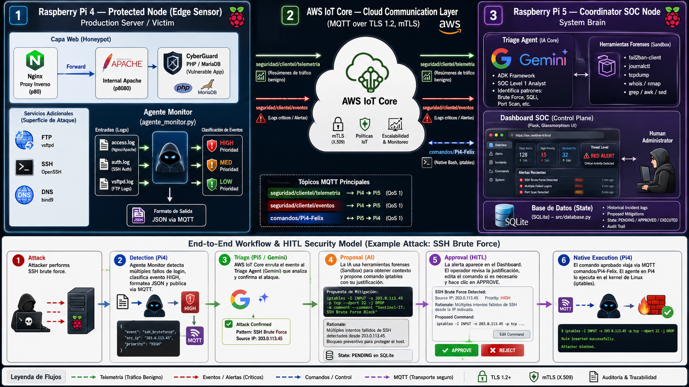

  

    <strong>Centro de Operaciones de Seguridad (SOC) Autónomo y Distribuido</strong>
     
    Una plataforma de Edge Computing potenciada por Inteligencia Artificial bajo un modelo Human-in-the-Loop.
     
     
    <a href="#-sobre-el-proyecto">Sobre el Proyecto</a>
    ·
    <a href="#-arquitectura">Arquitectura</a>
    ·
    <a href="#-características-principales">Características</a>
    ·
    <a href="#-stack-tecnológico">Stack Tecnológico</a>
  

 

  
  
  
  
  
  

 

## Sobre el Proyecto

**Sentinel-IT** es un Centro de Operaciones de Seguridad (SOC) a nivel de *Edge Computing*, diseñado para monitorizar, detectar y mitigar ciberataques en tiempo real. Aprovechando una topología distribuida con clústeres de Raspberry Pi y el poder analítico de la Inteligencia Artificial (Google Gemini ADK), el sistema procesa logs masivos de manera autónoma y aísla amenazas antes de que comprometan la red.Este proyecto simula un entorno empresarial realista donde servicios críticos (Web, FTP, SSH, Bases de datos) están expuestos, recopilando telemetría cifrada mediante **MQTT/mTLS** a través de **AWS IoT Core**.

---

## Arquitectura

El ecosistema opera mediante una topología de red distribuida compuesta por dos nodos principales:

### 1. Sensor Edge (Raspberry Pi 4)

Actuando como servidor de producción expuesto a internet, este nodo representa el objetivo principal y la primera línea de defensa.

* **Servicios Expuestos:** Apache/Nginx, FTP (vsftpd), SSH, MariaDB, DNS (dnsmasq).
* **Honeypots (CyberGuard):** Sistemas señuelo desplegados para capturar vectores de ataque (XSS, SQLi) y recopilar inteligencia de amenazas.
* **Telemetría y Gestión de Logs:** Funciona como un cliente IoT, extrayendo logs crudos y telemetría estructurada (Apache, vsftpd, auth.log) para publicarlos en tiempo real en la nube de AWS.
* **Gestión de Sesiones Activas:** Capacidad de monitorizar accesos (ej. robos de cookies por XSS) y cerrar sesiones PHP de forma remota en respuesta a Session Hijacking.

### 2. Coordinador SOC (Raspberry Pi 5)

Un sistema de orquestación centralizado que ingiere la telemetría del Sensor Edge y ejecuta decisiones tácticas.

* **Agente de Triage (IA Core):** Un Modelo de Lenguaje Grande (LLM) que actúa como analista de nivel 1, determinando si un evento es benigno o una amenaza activa.
* **Dashboard de Control:** Una interfaz web moderna en Flask utilizando *Glassmorphism* para visualizar estadísticas, niveles de amenaza y feeds en vivo.
* **Arquitectura Zero-Trust (HITL):** Antes de aplicar bloqueos de red o terminar procesos, la IA pone las acciones en cuarentena, requiriendo autorización manual del administrador.
* **Recuperación Ante Desastres:** Sistema automatizado de reposición y gestión de copias de seguridad del servidor de acceso, garantizando la continuidad del negocio tras incidentes críticos.

---

## Características Principales

* **Integración Cloud (AWS IoT Core):** Comunicación bidireccional, asíncrona y segura (mTLS) utilizando topics MQTT (`seguridad/clientel/#`, `comandos/#`).
* **Análisis Cognitivo:** Sustitución de reglas de firewall rígidas por una IA capaz de interpretar patrones anómalos (fuerza bruta, inyecciones SQL, escaneos) en milisegundos.
* **Modelo Human-in-the-Loop (HITL):** El administrador mantiene el control absoluto. El SOC propone mitigaciones destructivas pero espera confirmación visual mediante el Dashboard antes de enviarlas al nodo Edge.
* **Sandbox Forense:** El agente IA puede ejecutar comandos inofensivos de lectura (ej. `systemctl status`) para obtener contexto adicional antes de escalar una alerta.
* **Protección Activa de Aplicaciones Web:** Mitigación automatizada frente a Session Hijacking (mediante anulación de cookies de sesión comprometidas vía scripts CLI de PHP) e intentos de SQL Injection (SQLi) detectados en el honeypot.
* **Telemetría Avanzada:** Análisis dinámico del nivel de amenaza, distribución de vectores de ataque y auditoría completa de eventos en SQLite.

---

## Stack Tecnológico

### Hardware

* **Raspberry Pi 5** (Nodo Coordinador SOC)
* **Raspberry Pi 4** (Sensor Edge / Honeypot)

### Backend e IA

* Python 3
* Flask (Dashboard Web)
* Google ADK (Gemini LLM)
* Base de Datos SQLite

### Edge Services (PI-4)

* Apache, Nginx
* MariaDB
* vsftpd, iptables, dnsmasq
* PHP (Aplicación Honeypot CyberGuard)

### Cloud y Redes

* AWS IoT Core
* Protocolo MQTT
* Cifrado TLS 1.2 (mTLS)

---

## Autores

* **Daniel Alarcón Perea**
* **Félix Tejedor Zapatero**

*Trabajo de Fin de Grado (TFG) – Administración de Sistemas Informáticos en Red (ASIR)*
*Colegio Salesianos de Atocha (2026)*
