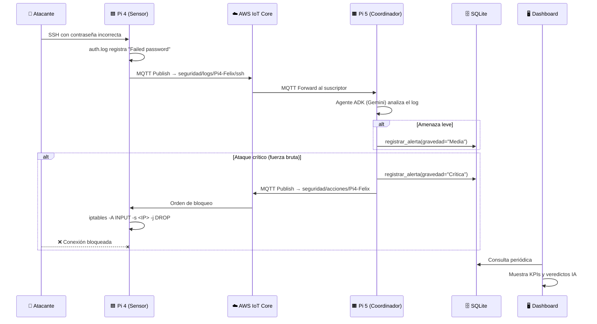

# 🚀 Guía de Despliegue Completa — TFG SOC IoT

---

# 🟦 RASPBERRY PI 4 (Nodo Sensor — Felix)

## Qué archivos llevar a la Pi 4

Copia **toda la carpeta** `pi4-felix/` a la Pi 4. Puedes usar `scp` desde tu PC:

```bash
scp -r pi4-felix/ pi@<IP_PI4>:/home/pi/TFG/pi4-felix/
```

La estructura que debe quedar en la Pi 4:

```
/home/pi/TFG/pi4-felix/
├── agente_monitor.py        ← Script principal (lee auth.log y publica en AWS)
├── aws_connector.py         ← Wrapper MQTT para AWS IoT Core
├── config.yml               ← Configuración centralizada
├── requirements.txt         ← Dependencias Python
├── setup.sh                 ← Instalador automático
├── soc-sensor.service       ← Daemon Systemd
├── Dockerfile               ← (Solo si despliegas con Docker)
├── Policy v2.json           ← Política AWS IoT (referencia)
│
│  ⬇️ ESTOS LOS GENERAS EN AWS IoT Core (no están en el repo):
├── Pi4-Felix.cert.pem       ← Certificado del dispositivo
├── Pi4-Felix.private.key    ← Clave privada del dispositivo
└── root-CA.crt              ← Certificado raíz de Amazon
```

## Paso 1 — Certificados AWS IoT

> [!IMPORTANT]
> Sin estos 3 archivos, la Pi 4 **no puede conectarse** a AWS.

1. Entra en **AWS IoT Core → Manage → Things** y crea un "Thing" llamado `Pi4-Felix`.
2. Genera y descarga los certificados (`.cert.pem`, `.private.key`, `root-CA.crt`).
3. Adjunta la política `Policy v2.json` al certificado.
4. Copia los 3 archivos al directorio `/home/pi/TFG/pi4-felix/`.

## Paso 2 — Instalación (Opción A: Systemd — Recomendada)

```bash
cd /home/pi/TFG/pi4-felix/
chmod +x setup.sh
sudo ./setup.sh
```

**¿Qué hace [setup.sh](file:///c:/Users/dania/OneDrive%20-%20Salesianos%20Atocha/Escritorio/PROGRAM/2ASIR/TFG/pi5-dani/setup.sh)?**

1. Comprueba que `python3` e `iptables` estén instalados.
2. Instala las dependencias: `pip3 install pyyaml awsiotsdk`.
3. Verifica que los certificados AWS estén presentes.
4. Instala y arranca el servicio Systemd [soc-sensor.service](file:///c:/Users/dania/OneDrive%20-%20Salesianos%20Atocha/Escritorio/PROGRAM/2ASIR/TFG/pi4-felix/soc-sensor.service).

**Verificar que funciona:**

```bash
sudo systemctl status soc-sensor
sudo journalctl -u soc-sensor -f    # Ver los logs en vivo
```

## Paso 2 — Instalación (Opción B: Docker)

Si prefieres Docker en vez de Systemd:

```bash
# Desde la raíz del proyecto (donde está docker-compose.yml)
docker-compose up -d soc-sensor-pi4
```

> [!NOTE]
> Docker monta `/var/log/auth.log` del host en modo solo lectura para que el sensor pueda leer los logs SSH reales.

## Qué hace cada archivo (Pi 4)

| Archivo                                                                                                                                | Función                                                                                                                                                                                                                                                                       |
| -------------------------------------------------------------------------------------------------------------------------------------- | ------------------------------------------------------------------------------------------------------------------------------------------------------------------------------------------------------------------------------------------------------------------------------ |
| [agente_monitor.py](file:///c:/Users/dania/OneDrive%20-%20Salesianos%20Atocha/Escritorio/PROGRAM/2ASIR/TFG/pi4-felix/agente_monitor.py)   | Monitoriza `/var/log/auth.log` en tiempo real con `tail -F`. Filtra líneas con `sshd` + `Failed password` o `Invalid user` y las publica vía MQTT a AWS IoT Core. También escucha órdenes de bloqueo de la Pi 5 y ejecuta `iptables -A INPUT -s <IP> -j DROP`. |
| [aws_connector.py](file:///c:/Users/dania/OneDrive%20-%20Salesianos%20Atocha/Escritorio/PROGRAM/2ASIR/TFG/pi5-dani/aws_connector.py)      | Clase[AWSMqttClient](file:///c:/Users/dania/OneDrive%20-%20Salesianos%20Atocha/Escritorio/PROGRAM/2ASIR/TFG/pi5-dani/aws_connector.py#7-68): gestiona la conexión mTLS, publish y subscribe a topics MQTT.                                                                       |
| [config.yml](file:///c:/Users/dania/OneDrive%20-%20Salesianos%20Atocha/Escritorio/PROGRAM/2ASIR/TFG/pi5-dani/config.yml)                  | Endpoint AWS, rutas de certificados, topics MQTT (`seguridad/logs/Pi4-Felix/ssh` y `seguridad/acciones/Pi4-Felix`), ruta del log del sistema.                                                                                                                              |
| [setup.sh](file:///c:/Users/dania/OneDrive%20-%20Salesianos%20Atocha/Escritorio/PROGRAM/2ASIR/TFG/pi5-dani/setup.sh)                      | Script bash que instala todo y configura el daemon Systemd automáticamente.                                                                                                                                                                                                   |
| [soc-sensor.service](file:///c:/Users/dania/OneDrive%20-%20Salesianos%20Atocha/Escritorio/PROGRAM/2ASIR/TFG/pi4-felix/soc-sensor.service) | Archivo de unidad Systemd: reinicio automático, arranca al boot.                                                                                                                                                                                                              |

---

# 🟧 RASPBERRY PI 5 (Nodo Coordinador — Dani)

## Qué archivos llevar a la Pi 5

Copia **toda la carpeta** `pi5-dani/` a la Pi 5:

```bash
scp -r pi5-dani/ pi@<IP_PI5>:/home/pi/TFG/pi5-dani/
```

La estructura que debe quedar en la Pi 5:

```
/home/pi/TFG/pi5-dani/
├── main_coordinator.py      ← Cerebro: recibe logs de AWS y los pasa al agente IA
├── dashboard_soc.py         ← Dashboard Web Flask (puerto 5000)
├── aws_connector.py         ← Wrapper MQTT  
├── base_datos.py            ← Inicializador de la BD SQLite
├── config.yml               ← Configuración centralizada
├── .env                     ← 🔑 Clave de Gemini (GEMINI_API_KEY)
├── requirements.txt         ← Dependencias Python
├── setup.sh                 ← Instalador automático
├── start_services.sh        ← Lanzador manual (para debug)
├── soc-coordinator.service  ← Daemon Systemd (coordinador IA)
├── soc-dashboard.service    ← Daemon Systemd (dashboard web)
├── Dockerfile               ← (Solo si despliegas con Docker)
│
├── agents/
│   └── soc_agent/
│       ├── soc_agent.py     ← Agente ADK (Gemini 3 Flash)
│       └── .env             ← Clave API Gemini (redundante, dotenv la busca aquí)
│
├── tools/
│   ├── __init__.py
│   ├── db_tools.py          ← Tool: registrar_alerta → guarda en SQLite
│   └── iot_tools.py         ← Tool: bloquear_ip → envía orden MQTT a Pi 4
│
├── templates/
│   └── index.html           ← Frontend del Dashboard
│
│  ⬇️ ESTOS LOS GENERAS EN AWS IoT Core:
├── Pi5-dani.cert.pem
├── Pi5-dani.private.key
└── root-CA.crt
```

## Paso 1 — Certificados AWS IoT

Igual que en la Pi 4, pero creando un Thing llamado `Pi5-dani`:

1. Genera certificados en AWS → descarga los 3 archivos.
2. Adjunta la política correspondiente.
3. Copia al directorio `/home/pi/TFG/pi5-dani/`.

## Paso 2 — Configurar la clave de Gemini

Crea o edita el archivo [.env](file:///c:/Users/dania/OneDrive%20-%20Salesianos%20Atocha/Escritorio/PROGRAM/2ASIR/TFG/pi5-dani/.env) en la carpeta `pi5-dani/`:

```bash
echo 'GEMINI_API_KEY=tu_clave_api_de_google_aqui' > /home/pi/TFG/pi5-dani/.env
```

> [!CAUTION]
> **Nunca subas el [.env](file:///c:/Users/dania/OneDrive%20-%20Salesianos%20Atocha/Escritorio/PROGRAM/2ASIR/TFG/pi5-dani/.env) a un repositorio público.** Contiene tu clave API de pago.

## Paso 3 — Instalación (Opción A: Systemd — Recomendada)

```bash
cd /home/pi/TFG/pi5-dani/
chmod +x setup.sh start_services.sh
sudo ./setup.sh
```

**¿Qué hace [setup.sh](file:///c:/Users/dania/OneDrive%20-%20Salesianos%20Atocha/Escritorio/PROGRAM/2ASIR/TFG/pi5-dani/setup.sh)?**

1. Instala `python3`, `pip` y dependencias de [requirements.txt](file:///c:/Users/dania/OneDrive%20-%20Salesianos%20Atocha/Escritorio/PROGRAM/2ASIR/TFG/pi5-dani/requirements.txt).
2. Verifica certificados AWS y [.env](file:///c:/Users/dania/OneDrive%20-%20Salesianos%20Atocha/Escritorio/PROGRAM/2ASIR/TFG/pi5-dani/.env).
3. Ejecuta `python3 base_datos.py` para crear la BD SQLite (`soc_data.db`).
4. Instala y arranca los 2 daemons Systemd:
   - `soc-coordinator` → [main_coordinator.py](file:///c:/Users/dania/OneDrive%20-%20Salesianos%20Atocha/Escritorio/PROGRAM/2ASIR/TFG/pi5-dani/main_coordinator.py)
   - `soc-dashboard` → [dashboard_soc.py](file:///c:/Users/dania/OneDrive%20-%20Salesianos%20Atocha/Escritorio/PROGRAM/2ASIR/TFG/pi5-dani/dashboard_soc.py)

**Verificar que funciona:**

```bash
sudo systemctl status soc-coordinator
sudo systemctl status soc-dashboard
sudo journalctl -u soc-coordinator -f
```

**Acceder al Dashboard:**

```
http://<IP_PI5>:5000
```

## Paso 3 — Instalación (Opción B: Docker)

```bash
# Desde la raíz del proyecto
docker-compose up -d soc-coordinator-pi5
```

> [!NOTE]
> Docker expone el puerto `5000` para el Dashboard y persiste la base de datos en un volumen (`soc_database_persistent`).

## Paso 3 — Ejecución Manual (para debug)

Si quieres ver la salida en la terminal directamente:

```bash
cd /home/pi/TFG/pi5-dani/

# Terminal 1: Dashboard
python3 dashboard_soc.py

# Terminal 2: Coordinador IA
python3 main_coordinator.py
```

## Qué hace cada archivo (Pi 5)

| Archivo                                                                                                                                    | Función                                                                                                                                                                                                                                                                                                                                                                      |
| ------------------------------------------------------------------------------------------------------------------------------------------ | ----------------------------------------------------------------------------------------------------------------------------------------------------------------------------------------------------------------------------------------------------------------------------------------------------------------------------------------------------------------------------- |
| [main_coordinator.py](file:///c:/Users/dania/OneDrive%20-%20Salesianos%20Atocha/Escritorio/PROGRAM/2ASIR/TFG/pi5-dani/main_coordinator.py)    | Se conecta a AWS IoT, se suscribe a `seguridad/logs/+/+`. Cada log recibido se pasa al agente ADK (`soc_agent.run()`).                                                                                                                                                                                                                                                    |
| [dashboard_soc.py](file:///c:/Users/dania/OneDrive%20-%20Salesianos%20Atocha/Escritorio/PROGRAM/2ASIR/TFG/pi5-dani/dashboard_soc.py)          | Servidor Flask en `:5000`. Lee la SQLite y muestra KPIs + tabla de incidentes.                                                                                                                                                                                                                                                                                              |
| [base_datos.py](file:///c:/Users/dania/OneDrive%20-%20Salesianos%20Atocha/Escritorio/PROGRAM/2ASIR/TFG/pi5-dani/base_datos.py)                | Crea la tabla[logs](file:///c:/Users/dania/OneDrive%20-%20Salesianos%20Atocha/Escritorio/PROGRAM/2ASIR/TFG/pi5-dani/dashboard_soc.py#52-64) en SQLite si no existe. Ejecutar 1 vez o en [setup.sh](file:///c:/Users/dania/OneDrive%20-%20Salesianos%20Atocha/Escritorio/PROGRAM/2ASIR/TFG/pi5-dani/setup.sh).                                                                       |
| [soc_agent.py](file:///c:/Users/dania/OneDrive%20-%20Salesianos%20Atocha/Escritorio/PROGRAM/2ASIR/TFG/pi5-dani/agents/soc_agent/soc_agent.py) | Define el agente ADK con instrucciones de triage SOC. Usa `gemini-3-flash`. Tiene 2 tools: [registrar_alerta](file:///c:/Users/dania/OneDrive%20-%20Salesianos%20Atocha/Escritorio/PROGRAM/2ASIR/TFG/pi5-dani/tools/db_tools.py#15-41) y [bloquear_ip](file:///c:/Users/dania/OneDrive%20-%20Salesianos%20Atocha/Escritorio/PROGRAM/2ASIR/TFG/pi5-dani/tools/iot_tools.py#24-61). |
| [db_tools.py](file:///c:/Users/dania/OneDrive%20-%20Salesianos%20Atocha/Escritorio/PROGRAM/2ASIR/TFG/pi5-dani/tools/db_tools.py)              | Tool[registrar_alerta](file:///c:/Users/dania/OneDrive%20-%20Salesianos%20Atocha/Escritorio/PROGRAM/2ASIR/TFG/pi5-dani/tools/db_tools.py#15-41): INSERT en SQLite con dispositivo, IP, gravedad, veredicto IA.                                                                                                                                                                   |
| [iot_tools.py](file:///c:/Users/dania/OneDrive%20-%20Salesianos%20Atocha/Escritorio/PROGRAM/2ASIR/TFG/pi5-dani/tools/iot_tools.py)            | Tool[bloquear_ip](file:///c:/Users/dania/OneDrive%20-%20Salesianos%20Atocha/Escritorio/PROGRAM/2ASIR/TFG/pi5-dani/tools/iot_tools.py#24-61): publica orden JSON en `seguridad/acciones/<dispositivo>` vía MQTT.                                                                                                                                                               |
| [config.yml](file:///c:/Users/dania/OneDrive%20-%20Salesianos%20Atocha/Escritorio/PROGRAM/2ASIR/TFG/pi5-dani/config.yml)                      | Endpoint AWS, certificados, topics, puerto web, modelo IA, configuración de logging.                                                                                                                                                                                                                                                                                         |

---

# 🎯 Flujo Completo de Operación



---

# 🧪 Probar el Sistema (Simulación de Ataque)

Desde un **tercer equipo** (tu portátil), ejecuta:

```bash
cd /ruta/al/proyecto/TFG/
python3 simulador_ataque.py <IP_PI4>
```

Esto lanza 20 intentos SSH fallidos contra la Pi 4. Deberías ver:

1. **Pi 4** → publica los logs sospechosos a AWS.
2. **Pi 5** → el agente IA detecta fuerza bruta y ejecuta [bloquear_ip](file:///c:/Users/dania/OneDrive%20-%20Salesianos%20Atocha/Escritorio/PROGRAM/2ASIR/TFG/pi5-dani/tools/iot_tools.py#24-61).
3. **Pi 4** → aplica `iptables DROP`.
4. **Atacante** → obtiene `Connection timed out` 🚨.
5. **Dashboard** → muestra el incidente con gravedad "Crítica" y acción "Bloqueo Activo".

---

# 📋 Checklist Pre-Defensa

| ✅ | Tarea                                                                                                                                           | Nodo        |
| -- | ----------------------------------------------------------------------------------------------------------------------------------------------- | ----------- |
| ☐ | Certificados AWS copiados                                                                                                                       | Pi 4 + Pi 5 |
| ☐ | [.env](file:///c:/Users/dania/OneDrive%20-%20Salesianos%20Atocha/Escritorio/PROGRAM/2ASIR/TFG/pi5-dani/.env) con `GEMINI_API_KEY` configurado    | Pi 5        |
| ☐ | [config.yml](file:///c:/Users/dania/OneDrive%20-%20Salesianos%20Atocha/Escritorio/PROGRAM/2ASIR/TFG/pi5-dani/config.yml) con endpoint AWS correcto | Pi 4 + Pi 5 |
| ☐ | `sudo ./setup.sh` ejecutado y sin errores                                                                                                     | Pi 4 + Pi 5 |
| ☐ | `systemctl status soc-sensor` → active                                                                                                       | Pi 4        |
| ☐ | `systemctl status soc-coordinator` → active                                                                                                  | Pi 5        |
| ☐ | `systemctl status soc-dashboard` → active                                                                                                    | Pi 5        |
| ☐ | Dashboard accesible en `http://<IP_PI5>:5000`                                                                                                 | Pi 5        |
| ☐ | Simulador de ataque funciona desde portátil                                                                                                    | Atacante    |
| ☐ | Después de ataque:`iptables -F` para limpiar bloqueos                                                                                        | Pi 4        |
